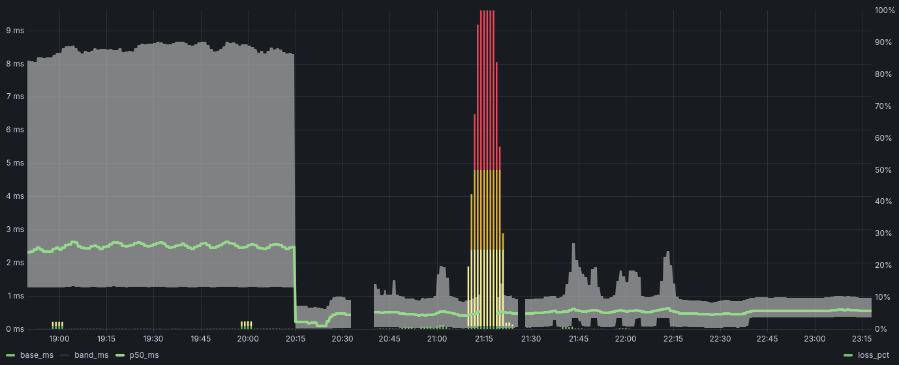

# TCP Ping Prometheus Exporter

A high-performance TCP ping exporter for Prometheus written in Go. It measures latency (RTT), packet loss, and connection stability by sending active TCP probes to target servers. It supports both client (prober) and server (echo) modes, with adaptive timeout capabilities to handle varying network conditions.

## Metrics

The exporter exposes the following metrics at `/metrics` (default port 2112).

| Metric Name | Type | Labels | Description |
|---|---|---|---|
| `tcp_echo_sent_total` | Counter | `target`, `address` | Total number of TCP echo requests sent. |
| `tcp_echo_received_total` | Counter | `target`, `address` | Total number of TCP echo responses received. |
| `tcp_echo_timeouts_total` | Counter | `target`, `address` | Total number of requests that timed out. Packet loss can be calculated from this. |
| `tcp_echo_dropped_total` | Counter | `target`, `address` | Total number of connection drops/failures. |
| `tcp_echo_rtt_seconds` | Histogram | `target`, `address` | Histogram of Round-Trip Times (RTT) in seconds. |
| `tcp_echo_last_rtt_seconds` | Gauge | `target`, `address` | The most recent RTT measurement in seconds. Useful for instant status. |
| `tcp_echo_connected` | Gauge | `target`, `address` | Connection status: `1` = Connected, `0` = Disconnected/Reconnecting. |
| `tcp_echo_estimated_timeout_seconds` | Gauge | `target`, `address` | Current adaptive Retransmission Timeout (RTO) being used. |

## PromQL Examples

Here are some common queries to monitor your TCP targets:

### Packet Loss Rate (%)
Calculate the percentage of lost packets over the last 5 minutes.
```promql
rate(tcp_echo_timeouts_total[5m]) / rate(tcp_echo_sent_total[5m]) * 100
```

### Average Latency (RTT)
Calculate the average round-trip time over the last 5 minutes.
```promql
rate(tcp_echo_rtt_seconds_sum[5m]) / rate(tcp_echo_rtt_seconds_count[5m])
```

### Connection Dropped Rate
Rate of connection drops (reconnections needed) per second.
```promql
rate(tcp_echo_dropped_total[5m])
```

### 99th Percentile Latency
Estimated P99 latency.
```promql
histogram_quantile(0.99, rate(tcp_echo_rtt_seconds_bucket[5m]))
```

### Connection Status
Check if the probe is currently connected (1) or down (0).
```promql
tcp_echo_connected
```

Build
-----
Build locally:

```sh
go build -o ./build/tcp_ping_prometheus .
```

Cross-compile for Windows (example):

```sh
CGO_ENABLED=0 GOOS=windows GOARCH=amd64 go build -o build/tcp_ping_prometheus.exe .
```

Test
-----

Run the test suite:

```sh
go test -v ./...
```


Release binaries for Linux, macOS (darwin) and Windows - [Latest Release](https://github.com/callumau/tcp_ping_prometheus/releases/latest)

Usage
-----
- -mode: server | client | both (default "server")
- -listen: server listen address (default ":4000")
- -target: client target address (default ":4000") - use -targets for multiple
- -targets: JSON file with list of targets (client)
- -metrics: HTTP address for Prometheus /metrics (default ":2112")
- -interval: Base probe interval (min interval if adaptive) (default 500ms)
- -timeout: Base/Initial timeout (default 1s)
- -adaptive: Enable adaptive timeout/interval based on link quality (default true)
- -json-logs: Log in JSON format instead of text
- -svc: service action: install | uninstall | start | stop | run (uses kardianos/service on Windows)

JSON Targets Format:

The -targets flag expects a JSON file containing an array of objects, each with "name" and "address" fields.

Example targets.json:

```json
[
  {"name": "server1", "address": "192.168.1.10:4000"},
  {"name": "server2", "address": "192.168.1.11:4000"}
]
```

Examples (also in [example_queries.txt](example_queries.txt)):

Client (single target):
```
./tcp_ping_prometheus -mode=client -target="192.168.1.71:4000" -interval=10ms -timeout=20ms -metrics=":2113" -window=100
```

Client (multiple targets):
```
./tcp_ping_prometheus -mode=client -targets=targets.json -interval=10ms -timeout=20ms -metrics=":2113" -window=100
```

Server:
```
./tcp_ping_prometheus -mode=server -listen=":4000" -metrics=":2112"
```

Both:
```
./tcp_ping_prometheus -mode=both -targets=targets.json -interval=10ms -timeout=20ms -metrics=":2113" -window=100
```

Service
-------

### Windows

Use the `-svc` flag to install/uninstall/start/stop/run the service. When installing, the tool records the runtime flags to ensure the service starts with the same configuration.

```
tcp_ping_prometheus.exe -mode=both -targets=targets.json -interval=10ms -timeout=20ms -metrics=":2113" -window=100 -svc=install
```

### Linux

To run as a systemd service, create a file at `/etc/systemd/system/tcp_ping_prometheus.service`:

```ini
[Unit]
Description=TCP Echo Metrics
After=network.target

[Service]
ExecStart=/usr/local/bin/tcp_ping_prometheus -mode=server -listen=":4000" -metrics=":2112"
Restart=always
User=nobody

[Install]
WantedBy=multi-user.target
```

**Note regarding targets.json**: If running in client or both mode, ensure you provide the **absolute path** to the targets file in the `-targets` flag (e.g., `-targets=/etc/tcp_ping_prometheus/targets.json`) and that the designated `User` has read permissions for the file.

Reload systemd and start the service:

```sh
sudo systemctl daemon-reload
sudo systemctl enable --now tcp_ping_prometheus
```

Metrics
-------
The exporter serves Prometheus metrics at /metrics on the address given by `-metrics` (default :2112). 

Prebuilt Grafana Dashboard [grafana-dashboard.json](grafana-dashboard.json).

[](.docs/screenshot01.png)

Key functions and types
-----------------------
- [`runClient`](tcp_ping_prometheus.go) — load targets and start probing.
- [`runServer`](tcp_ping_prometheus.go) — TCP echo server.
- [`probeTarget`](tcp_ping_prometheus.go) — handles the connection lifecycle for a single target.
- [`runEchoLoop`](tcp_ping_prometheus.go) — main loop for sending/receiving probes and handling timeouts.
- [`AdaptiveStats`](tcp_ping_prometheus.go) — implements RFC 6298-inspired RTO calculation.

Notes
-----
- Wire format: 24 bytes per probe (8-byte magic header "TCPPING\x00", 8-byte sequence, 8-byte Unix-ns timestamp). See [tcp_ping_prometheus.go](tcp_ping_prometheus.go).
- Histogram buckets chosen for 100µs .. ~2s RTTs.
- The release workflow produces binaries for linux, windows, and darwin and packages each artifact (see [.github/workflows/new-release-build.yml](.github/workflows/new-release-build.yml)).
- Security: This tool is intended for internal network monitoring. The TCP echo server validates a magic header ("TCPPING\x00") before echoing data to prevent arbitrary payload reflection, but it is still recommended to restrict access to trusted networks. The metrics endpoint serves data without authentication; protect it accordingly.

