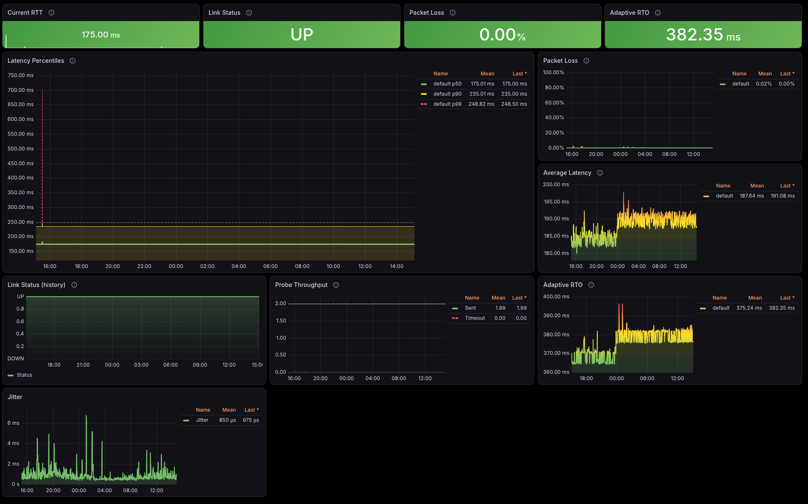

# Link Monitor (TCP Ping Prometheus Exporter)

A high-performance **site-to-site link monitor** for Prometheus written
in Go. It measures latency (RTT), packet loss, jitter, and connection
stability between two sites by sending active TCP probes across the
link, with adaptive timeout capabilities (RFC 6298).

## Typical Deployment: Site A ↔ Site B

1. **Remote site (B):** run the echo server.
   `./tcp_ping_prometheus -mode=server -listen=":4000" -metrics=":2112"`
2. **Local site (A):** run the client, targeting site B's address.
   `./tcp_ping_prometheus -mode=client -target="203.0.113.10:4000" -metrics=":2112"`
3. Scrape both `/metrics` endpoints into Prometheus (or forward via
   Grafana Alloy, see below) and open the bundled dashboard.

Each configured target is one monitored link. The dashboard gives the
per-link picture: `link_up` status, `link_loss_ratio` over a 10-minute
window, RTT percentiles (p50/p90/p99), jitter, adaptive RTO, and
throughput counters.

## Metrics

The exporter exposes the following metrics at `/metrics` (default port 2112).

| Metric Name | Type | Labels | Description |
|---|---|---|---|
| `link_up` | Gauge | `target`, `address` | 1 = connected, 0 = disconnected/reconnecting. |
| `link_loss_ratio` | Gauge | `target`, `address` | Packet loss ratio (0.0–1.0) over the last 10 min (timeouts / sent). |
| `link_probes_sent_total` | Counter | `target`, `address` | Total probes sent on established connections (dial failures excluded). |
| `link_probes_received_total` | Counter | `target`, `address` | Total probe responses received and validated. |
| `link_probes_timed_out_total` | Counter | `target`, `address` | Total probes that timed out. |
| `link_connections_dropped_total` | Counter | `target`, `address` | Total established connections lost mid-probing. |
| `link_connect_failures_total` | Counter | `target`, `address` | Total failed connection attempts (dial errors). Not counted in sent/timeout totals. |
| `link_rtt_seconds` | Summary | `target`, `address` | Sliding-window RTT percentiles over 10 min (p50, p90, p99). |
| `link_rtt_seconds_sum` | Summary | `target`, `address` | Sum of RTT over the 10 min window (divide by `_count` for mean). |
| `link_rtt_seconds_count` | Summary | `target`, `address` | Response count over the 10 min window. |
| `link_last_rtt_seconds` | Gauge | `target`, `address` | Most recent RTT measurement. |
| `link_rto_seconds` | Gauge | `target`, `address` | Current adaptive RTO in use. |
| `link_server_probes_received_total` | Counter | `client` | Valid probes received by the server, per remote client IP (server mode only). |

## PromQL Examples

### Link Packet Loss (10-min Window)

The `link_loss_ratio` gauge (0.0–1.0) is the monitoring number for a
link: client-visible loss over the last 10 minutes, computed from the
same window as the RTT percentiles. It survives connection drops and
resets cleanly on restart.

```
link_loss_ratio * 100
```

For arbitrary windows, derive loss from the counters instead:

```
rate(link_probes_timed_out_total[5m]) / rate(link_probes_sent_total[5m]) * 100
```

Both express **application-visible** loss, not raw network loss. Each
probe is a single TCP segment, and the kernel retransmits lost segments
(TCP RTO ~1s, doubling). Segments recovered faster than the client's
adaptive RTO still count as received — with inflated RTT. With a link
loss simulator (e.g. clumsy) at X%, expect the loss gauge to sit notably
below X%, while RTT percentiles climb.

While the client cannot connect at all, `link_up == 0` and
`rate(link_connect_failures_total[5m]) > 0` are the conditions to alert
on — the loss ratio is undefined for a down link rather than pinned at
100%.

To measure true network loss, run the server at the remote site and
compare its per-client `link_server_probes_received_total` against the
client's `link_probes_sent_total`. The server counter is labelled with
the remote client address (`client="203.0.113.5"`); select it explicitly
to correlate with the client's series:

```
100 * (1 - rate(link_server_probes_received_total{client="203.0.113.5"}[5m])
           / rate(link_probes_sent_total{target="site-b"}[5m]))
```

Segments never delivered to the server are genuinely lost on the wire —
no retransmission can hide them there.

### Average Latency (10-min Window)

The summary's `_sum`/`_count` span the same 10-minute sliding window as
the quantiles, so the mean matches the percentiles plotted alongside it.
Do NOT use `rate()` on them — they are not counters; the window resets
every 10 minutes.

```
link_rtt_seconds_sum / link_rtt_seconds_count
```

### Median / 90th / 99th Percentile Latency (Sliding Window)

```
link_rtt_seconds{quantile="0.5"}
link_rtt_seconds{quantile="0.9"}
link_rtt_seconds{quantile="0.99"}
```

### Jitter (p90 − p50)

```
(link_rtt_seconds{quantile="0.9"} - link_rtt_seconds{quantile="0.5"}) * 1000
```

### Detecting a Baseline Shift (latency change detection)

Compare the current 10-minute window against a longer baseline. Latency
drift on a long-running link shows up as the recent window diverging
from a 24h minimum:

```
link_rtt_seconds{quantile="0.5"}
  > min_over_time(link_rtt_seconds{quantile="0.5"}[24h]) * 1.5
```

Outages show up immediately in `link_up == 0`,
`rate(link_probes_timed_out_total[5m]) > 0`, and the adaptive RTO climbing
via `link_rto_seconds`.

### Connection Status

```
link_up
```

### Outage Alerts

```
alert: LinkDown
  expr: link_up == 0
  for:  1m

alert: LinkLossHigh
  expr: link_loss_ratio > 0.2
  for:  5m

alert: LinkLatencyDegraded
  expr: link_rtt_seconds{quantile="0.5"} > min_over_time(link_rtt_seconds{quantile="0.5"}[24h]) * 1.5
  for:  10m
```

## Grafana Alloy Scraping

The example below scrapes the metrics endpoint, keeps only `tcp_*`
metrics (dropping `go_*`, `process_*`, and the Prometheus client's own
internals to save remote-write bandwidth and storage), and forwards the
result to a `prometheus.remote_write` component.

Add your own `prometheus.remote_write "default"` block (endpoint URL,
credentials) — it is intentionally not included here. If the remote
write component has a different name, update the
`prometheus.remote_write.default.receiver` reference below.

```river
prometheus.scrape "tcp_ping" {
	targets = [{
		"__address__" = "localhost:2112",
	}]
	metrics_path    = "/metrics"
	scrape_interval = "1m"
	scrape_timeout  = "10s"
	forward_to      = [prometheus.relabel.tcp_ping_keep.receiver]
}

prometheus.relabel "tcp_ping_keep" {
	rule {
		source_labels = ["__name__"]
		regex         = "link_.*"
		action        = "keep"
	}
	forward_to = [prometheus.remote_write.default.receiver]
}
```

If the agent and the prober run on different hosts, replace
`localhost:2112` with the prober's address. With metrics basic auth
enabled, add a `basic_auth` block to the scrape targets instead:

```river
prometheus.scrape "tcp_ping" {
	targets = [{
		"__address__" = "10.0.0.5:2112",
	}]
	...
	basic_auth {
		username = "monitoring"
		password = "secret"
	}
}
```

## Build

```sh
go build -o ./build/tcp_ping_prometheus .
```

Cross-compile for Windows:

```sh
CGO_ENABLED=0 GOOS=windows GOARCH=amd64 go build -o build/tcp_ping_prometheus.exe .
```

## Test

```sh
go test -count=1 ./test/...
```

Release binaries for Linux, macOS, Windows at [Latest Release](https://github.com/callumau/tcp_ping_prometheus/releases/latest).

## Usage

```
tcp_ping_prometheus -mode=<mode> [flags]
```

### Flags

| Flag | Default | Description |
|---|---|---|
| `-mode` | `server` | Operation mode: `server`, `client`, `both` |
| `-listen` | `:4000` | Server listen address |
| `-target` | `""` | Client: single target `host:port` |
| `-targets` | `""` | Client: path to JSON targets file |
| `-metrics` | `:2112` | Prometheus metrics HTTP listen address |
| `-interval` | `500ms` | Client: probe interval (must stay well below server `-read-timeout`) |
| `-timeout` | `1s` | Client: Base/initial probe timeout |
| `-adaptive` | `true` | Enable adaptive RTO based on link quality |
| `-read-timeout` | `10s` | Server: idle read deadline per connection |
| `-metrics-user` | `""` | Basic auth username for /metrics (empty = disabled; env `TCP_PING_METRICS_USER`) |
| `-metrics-pass` | `""` | Basic auth password for /metrics (env `TCP_PING_METRICS_PASS`; prefer env over CLI to avoid `ps` exposure) |
| `-metrics-tls-cert` | `""` | TLS certificate file for /metrics (requires `-metrics-tls-key`) |
| `-metrics-tls-key` | `""` | TLS private key file for /metrics (requires `-metrics-tls-cert`) |
| `-json-logs` | `false` | Output logs in JSON format |
| `-svc` | `""` | Windows service action: `install`, `uninstall`, `start`, `stop`, `run` |

### Targets File

JSON file with an array of `{"name": "...", "address": "host:port"}` objects:

```json
[
  {"name": "server1", "address": "192.168.1.10:4000"},
  {"name": "server2", "address": "192.168.1.11:4000"}
]
```

Max 1000 targets, max file size 1 MB.

### Examples

Client (single target):

```sh
./tcp_ping_prometheus -mode=client -target="192.168.1.71:4000" -interval=10ms -timeout=20ms -metrics=":2113"
```

Client (multiple targets):

```sh
./tcp_ping_prometheus -mode=client -targets=targets.json -interval=10ms -timeout=20ms -metrics=":2113"
```

Server:

```sh
./tcp_ping_prometheus -mode=server -listen=":4000" -metrics=":2112"
```

Both:

```sh
./tcp_ping_prometheus -mode=both -targets=targets.json -interval=10ms -timeout=20ms -metrics=":2113"
```

## Service

### Windows

Use `-svc` to install/uninstall/start/stop/run. The tool records runtime flags at install time (excluding `-svc`, `-metrics-user`, and `-metrics-pass`). Metrics auth credentials are **not** persisted into the service configuration; set `TCP_PING_METRICS_USER` / `TCP_PING_METRICS_PASS` in the service environment instead (a warning is printed at install time).

```
tcp_ping_prometheus.exe -mode=both -targets=targets.json -interval=10ms -timeout=20ms -metrics=":2113" -svc=install
```

### Linux (systemd)

Create `/etc/systemd/system/tcp_ping_prometheus.service`:

```ini
[Unit]
Description=TCP Ping Prometheus
After=network.target

[Service]
ExecStart=/usr/local/bin/tcp_ping_prometheus -mode=server -listen=":4000" -metrics=":2112"
Restart=always
User=nobody

[Install]
WantedBy=multi-user.target
```

Note: In client/both mode, use an absolute path for `-targets` (e.g., `-targets=/etc/tcp_ping_prometheus/targets.json`).

```sh
sudo systemctl daemon-reload
sudo systemctl enable --now tcp_ping_prometheus
```

## Grafana Dashboard

Prebuilt dashboard at [grafana-dashboard.json](grafana-dashboard.json).

[](.docs/screenshot01.png)

## Code Structure

```
main.go                     — CLI wrapper, flag parsing, service lifecycle
main_test.go                — lifecycle race, auth/TLS flag validation tests
internal/prober/
  prober.go                 — Config, protocol constants
  adaptive.go               — RFC 6298 RTO estimation (AdaptiveStats)
  client.go                 — Target, LoadTargets, RunClient, probe loop
  server.go                 — RunServer, ServeListener, connection handler
  metrics.go                — Prometheus metric vars, InitMetrics, MetricsAuth
  validate.go               — Target address validation (ValidateTarget)
  pool.go                   — sync.Pool for probe buffer reuse
test/
  helpers_test.go           — Test utilities (metric inspectors, echo server)
  adaptive_test.go          — AdaptiveStats logic and jitter adaptation
  validation_test.go        — LoadTargets, target parsing, Config validation
  server_test.go            — Server garbage handling, limits, shutdown
  client_test.go            — Robustness: loss, latency, corruption, spoofing, stalls, duplicates
  metrics_test.go           — Basic auth handler, metric seeding
  integration_test.go       — Multi-target, server dropout, stress (10 targets)
```

## Wire Protocol

24 bytes per probe:

| Offset | Size | Field |
|---|---|---|
| 0 | 8 | Magic header `TCPPING\x00` |
| 8 | 8 | Sequence number (little-endian uint64) |
| 16 | 8 | Client timestamp (Unix ns, little-endian uint64) |

The server validates the magic header before echoing; invalid data closes the connection immediately. The client additionally requires the echoed timestamp to exactly match the value it sent — corrupted, replayed, or spoofed responses are discarded and counted as loss on timeout, protecting RTT samples from poisoning.

The server enforces a maximum of 1000 concurrent connections globally and 128 per remote IP; excess connections are dropped. Per-connection read deadlines (`-read-timeout`, default 10 s) and write deadlines (5 s) prevent resource starvation; transient accept errors back off exponentially. Client `-interval` must stay well below the server's read deadline or connections will be closed for idleness.

## Security

- The TCP echo server validates a magic header before echoing to prevent arbitrary payload reflection, and caps connections globally and per source IP.
- Echoed timestamps are validated exactly (see Wire Protocol), so off-path corruption and replays cannot fabricate RTT samples.
- The `/metrics` endpoint supports HTTP Basic Auth (`-metrics-user` / `-metrics-pass`) with constant-time comparison over hashed credentials. Both must be set together; the process refuses to start with only one.
- Prefer the `TCP_PING_METRICS_USER` / `TCP_PING_METRICS_PASS` environment variables over CLI flags — flag values are visible in `ps` to other local users.
- Basic Auth without TLS sends credentials as base64 on the wire; a startup warning is logged in that configuration. Use `-metrics-tls-cert` / `-metrics-tls-key` to serve `/metrics` over HTTPS.
- The wire protocol carries no sensitive data (sequence numbers and wall-clock timestamps only) and has no TLS — intended for internal network monitoring. Restrict access with a firewall on untrusted networks.
